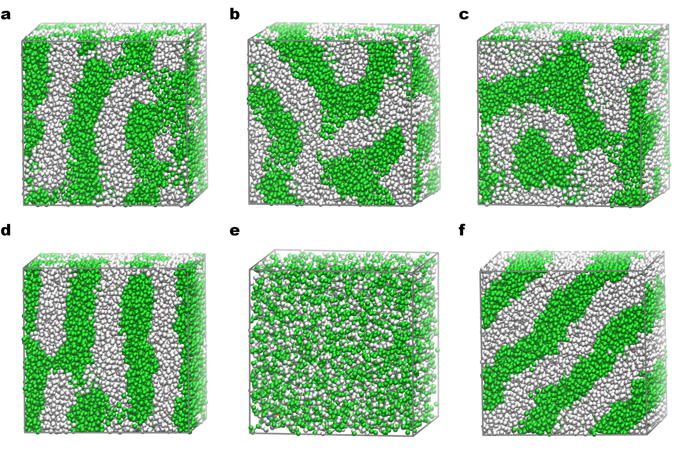

<div align="center">
    <h1>EdSr: A Novel End-to-End Approach for State-Space Sampling in Molecular Dynamics Simulation</h1>
     <p align="center"> 
        Hai-Ming Cao<sup>1</sup> · <a href="https://scholar.google.com/citations?hl=en&user=iOIRgyAAAAAJ">Bin Li</a><sup>1*</sup>
    </p>
    <p align="center"> 
        <b>School of Chemical Engineering and Technology, Sun Yat-Sen University, Zhuhai 519082, China</b>
    </p>
    <p align="center"> 
    <sup>*</sup> E-mail: libin76@mail.sysu.edu.cn
    </p>
    </p>  
    <a href="https://github.com/haiming-Cao/EdSr/blob/main/LICENSE">
    
    </a>
    <a href="https://arxiv.org/abs/2412.20978">
    
    </a>
    <a href="https://arxiv.org/abs/2412.20978">
    
    </a>
</a>

</div>

## Overview

> The molecular dynamics (MD) simulation technique has been widely used in complex systems, but the accessible time scale is limited due to the requirement of small integration timesteps. Here, we propose a novel method, named Exploratory dynamics Sampling with recursion (EdSr), inspired by ordinary differential equation and Taylor expansion formula, which enables flexible  adjustment of timestep in MD simulations. By setting up five groups of experiments including simple functions, ideal physical models, all-atom simulations and coarse-grained simulations, dissipative particle dynamics simulations, we demonstrate that EdSr can dynamically and flexibly adjust the simulation timestep according to the requirements during simulation period, and operate with larger timesteps than the widely used velocity-Verlet integrator.Besides, we provide rEdSr to hold on longer simulation by mitigating the effect of velocity drift. Although the method can not perform perfectly at flexible timestep across all simulation systems, we believe that it provides a promising direction for future studies.


## 🛠️ Requirements

> [!IMPORTANT] 
> PYTHON version >= 3.11

Third-Party Package|Version|
|:-:|:-:|
|numpy|>=1.26.0|
|scipy|>=1.11.3|
|einops|>=0.6.1|
|tqdm|>=4.65.0|
|matplotlib|>=3.7.2|
|lammps|==2024.4.17|
|mpi4py|>=3.1.6|

## 📖 Method

> [!TIP]
> If you set the value N smaller such as 3 and then expand the formula, you will find that this is a Taylor formula.

The part of displacement of EdSr can be rewritten as the following form:

$$
X_{n-1} = X_N + \frac{1}{2n-1} \Big(X'_N\Delta t - \frac{1}{2n}\frac{\nabla_X U(X_n)}{M}(\Delta t)^{2}\Big), \quad n\ \rm{for}\ N\ to\ 1 
$$

where $X_0$, $X_N$, $X_N'$ denote $X(t+\Delta t)$, $X(t)$, $X'(t)$ respectively. According to the definition of derivative, the part of velocity of EdSr can be expressed as:

$$
X_{n-1} =  X_N + \frac{1}{2n-2} \Big(X'_N\Delta t - \frac{1}{2n-1}\frac{\nabla_X U(X_n)}{M}(\Delta t)^{2}\Big), \quad n\ \rm{for}\ N\ to\ 2
$$

$$
X'_0 =  X'_N - \frac{\nabla_X U(X_1)}{M}\Delta t,  \quad  n = 1
$$

where $X'_0$ denotes $X'(t+\Delta t)$. 

## 📈 Results

> [!NOTE] 
> In this section, we only show figures for each experiment. if you are interested in our work, you can get to know from our [paper](https://arxiv.org/abs/2412.20978) and [supplementary](https://arxiv.org/abs/2412.20978).

<!-- <div class="admonition note">
<p class="admonition-title">In this section, we only show figures for each experiment. if you are interested in our work, you can get to know from <a href="https://arxiv.org/abs/2412.20978">our paper</a> and <a href="https://arxiv.org/abs/2412.20978">supplementary</a></p>
</div> -->

### Equation

 | 
|-|-|

### ideal spring

| 
|-|-|

### DPD
    0.02 tau (top) and 0.12 tau (bottom)



## 🚀 Usage

### Pre-learn

* **PYTHON With LAMMPS in** [tutorial for installation](https://docs.lammps.org/Python_install.html)

* **Gromacs** in [tutorial](https://www.gromacs.org/tutorial_webinar.html)

### Environment set up
We highly recommend Conda because all of our experiments are run under [Miniconda](https://docs.anaconda.com/miniconda/) environment

Before performing every experiment, run the following command to build your Conda environment:
```bash
conda create -n lammps python=3.11.5
```
and then run command `conda activate lammps` to test your environment.

### Examples
We provide three choices for each experiment, you can choose one of them to run experiment.

**For Equation**:
1. Use [jupyter notebook](https://jupyter.org/) to run .ipynb file directly. (*you can use conda to install the jupyter extension. Alternatively, you can install extension in VScode*)
2. Install jupyter extension and use command `jupyter nbconvert --to python *.ipynb` to tranform `*.ipynb` file to `*.py` file. Then you can use command `python *.py` to visualize your data.
3. Edit Equation/Equation to select function that you want. Run command `python Equation.py` (**Equation_thirdOrder.py** file is for $y = x^3$)

**For IdealSpring**:
1. Use [jupyter notebook](https://jupyter.org/) to run .ipynb file directly. (*you can use conda to install the jupyter extension. Alternatively, you can install extension in VScode*)
2. Install jupyter extension and use command `jupyter nbconvert --to python *.ipynb` to tranform `*.ipynb` file to `*.py` file. Then you can use command `python *.py` to visualize your data.
2. run command `python idealSpring.py`

**For IdealPendulum**:
1. Use [jupyter notebook](https://jupyter.org/) to run .ipynb file directly. (*you can use conda to install the jupyter extension. Alternatively, you can install extension in VScode*)
2. Install jupyter extension and use command `jupyter nbconvert --to python *.ipynb` to tranform `*.ipynb` file to `*.py` file. Then you can use command `python *.py` to visualize your data.
2. run command `python idealPendulum.py`

**For twoBody**
1. Use [jupyter notebook](https://jupyter.org/) to run .ipynb file directly. (*you can use conda to install the jupyter extension. Alternatively, you can install extension in VScode*)
2. Install jupyter extension and use command `jupyter nbconvert --to python *.ipynb` to tranform `*.ipynb` file to `*.py` file. Then you can use command `python *.py` to visualize your data.
2. if you want to test your data, you can edit `twoBodies.py` and then run command `python twoBodies.py`.

**For Indole**:

```bash
#!/bin/bash
#SBATCH --partition deimos
#SBATCH -N 1
#SBATCH --job-name edsr

source ~/miniconda3/etc/profile.d/conda.sh
source activate base

module load mpi/mpich/4.1.2-icc-oneapi2023.2-ch4
export LD_LIBRARY_PATH=$LD_LIBRARY_PATH:/APP/u22/x86/lib
export OMP_NUM_THREADS=32

bash_pid=$$

# path of default arguments
jsonfile="params.json"

ntimestep=5

# benchmark timestep
basis=0.01 
# EdSr equation number of order
maxIter=50
# number of frames
ntrajs=200000
# choose one in ['benchmark', 'control', 'EdSr', 'vv']
mode="EdSr" 
# condition, only support nve condition so far.
ensemble="nve" 
# before run MD or EdSr, you can set this value to run "benchmark" timestep.
prerun_step=0 
# positive integer. similar to the LAMMPS thermo command.
thermo=200 
# 0, ~0 mean False, True in python, respectively.
# Taking split argument is 100 and drop_last argument is 1 for example, if you run 105 step, the last 5 step will be dropped.
drop_last=0 
# number of frames saving to each npz file, non-positive number means the total trajectory will be save into a npz file
split=-1 
# if you do not want to write basical setting of your simulation in the core.py, you can provide path of env_set.lammps.
# Except you understand how the program run, don't write some commands in your env_set.lammps (details in README.md).
lmpfile="env_set.lammps" 

logpath="log"
prefix="Indole"
debug=0 # ~0 denotes default arguments of debugging

# exec 2>&1>"${mode}_${ensemble}_basis${basis}_scale_intv${ntimestep}_frames${ntrajs}_iter${maxIter}_${bash_pid}.log"
exec 2>&1>"${logpath}/${prefix}_${mode}_${ensemble}_basis${basis}_intv${ntimestep}_frames${ntrajs}_${bash_pid}.log"

# # the first choice to run the program
python -u grid_loop.py --ntrajs $ntrajs --en  $ensemble --basis  $basis  --ntimestep   $ntimestep \
                             --split  $split  --debug  $debug  --prerun_step $prerun_step \
                             --thermo $thermo --maxiter $maxIter  --mode   $mode   --drop_last   $drop_last \
                             --prefix $prefix

# the second choice to run the program
# nohup python -u grid_loop.py --params $jsonfile &

py_pid=$!
echo 
echo "Current Bash ID: ${bash_pid}"
echo "Python Process ID: ${py_pid}"
echo 

```
You can edit these variables according to your need. For example, if you want to change timestep, you can edit variables `basis` and `ntimestep` in `EdSr.sh` bash file. Benchmark timestep is `basis`. MD or EdSr timestep is `basis * ntimestep`.

> [!WARNING]
> Except you understand how the program runs, don't write the following commands in your env_set.lammps:

|Command||
|:-:|:-:|
|atom_modify|the program has disabled the sort function using command `sort 0 0.0` in `core.py`.|
|fix nve/nvt|you can modify `create_simulation` function in `core.py`.|
|thermo_style |alternatively, you can edit `params.json`.|
|timestep |same as `thermo_style`|
|package / suffix| the program has used  `package omp num_threads neigh yes` and `suffix omp`|
|thermo_modify| we have used `thermo_modify lost/bond ignore` in the program, please clearly understand conflict or restrictions between them.|
|thermo| we have set thermo value to 1 in the program.

*After getting data, there are two choices for data visualization:*
1. Use [jupyter notebook](https://jupyter.org/) to run .ipynb file directly. (*you can use conda to install the jupyter extension. Alternatively, you can install extension in VScode*)
2. Install jupyter extension and use command `jupyter nbconvert --to python *.ipynb` to tranform `*.ipynb` file to `*.py` file. Then you can use command `python *.py` to visualize your data.

**For ubiquitin[_nowater]**
Before running experiment, you need to generate structure file sppuorted by LAMMPS, namely that you either directly data file supported by **LAMMPS** or generate file supported by **GROMACS** firstly, and then tranform **GROMACS** files to LAMMPS files. 
After that, you can run the following command:
```bash
cd ubiquitin[_nowater]/our
bash EdSr.sh
```

In the `EdSr.sh` bash file, the code is shown as follows:
```bash
#!/bin/bash
#SBATCH --partition deimos
#SBATCH -N 1
#SBATCH --job-name edsr_Ubq

source ~/miniconda3/etc/profile.d/conda.sh
source activate base

module load mpi/mpich/4.1.2-icc-oneapi2023.2-ch4
export LD_LIBRARY_PATH=$LD_LIBRARY_PATH:/APP/u22/x86/lib
export OMP_NUM_THREADS=32

bash_pid=$$

# path of default arguments
jsonfile="params.json"

ntimestep=15

# benchmark timestep
basis=1.0
# EdSr equation number of order
maxIter=50
# number of frames
ntrajs=20000 
# choose one in ['benchmark', 'control', 'EdSr', 'vv']
mode="EdSr" 
# condition, only support nve condition so far.
ensemble="nve" 
# before run MD or EdSr, you can set this value to run "benchmark" timestep.
prerun_step=0 
# positive integer. similar to the LAMMPS thermo command.
thermo=200 
# 0, ~0 mean False, True in python, respectively.
# Taking split argument is 100 and drop_last argument is 1 for example, if you run 105 step, the last 5 step will be dropped.
drop_last=0 
# number of frames saving to each npz file, non-positive number means the total trajectory will be save into a npz file
split=10000 
# if you do not want to write basical setting of your simulation in the core.py, you can provide path of env_set.lammps.
# Except you understand how the program run, don't write some commands in your env_set.lammps (details in README.md).
lmpfile="env_set.lammps" 

logpath="log"
prefix="Ubq"
debug=0 # ~0 denotes default arguments of debugging

# exec 2>&1>"${mode}_${ensemble}_basis${basis}_scale_intv${ntimestep}_frames${ntrajs}_iter${maxIter}_${bash_pid}.log"
exec 2>&1>"${logpath}/${prefix}_${mode}_${ensemble}_basis${basis}_intv${ntimestep}_frames${ntrajs}_${bash_pid}.log"

# # the first choice to run the program
python -u grid_loop.py --ntrajs $ntrajs --en  $ensemble --basis  $basis  --ntimestep   $ntimestep \
                             --split  $split  --debug  $debug  --prerun_step $prerun_step \
                             --thermo $thermo --maxiter $maxIter  --mode   $mode   --drop_last   $drop_last \
                             --prefix $prefix

# the second choice to run the program
# nohup python -u grid_loop.py --params $jsonfile &

py_pid=$!
echo 
echo "Current Bash ID: ${bash_pid}"
echo "Python Process ID: ${py_pid}"
echo 

```

*After getting data, there are two choices for data visualization:*
1. Use [jupyter notebook](https://jupyter.org/) to run .ipynb file directly. (*you can use conda to install the jupyter extension. Alternatively, you can install extension in VScode*)
2. Install jupyter extension and use command `jupyter nbconvert --to python *.ipynb` to tranform `*.ipynb` file to `*.py` file.


**For DPD simulation**
```
Same as other MD simulations.
```

> [!TIP]
> if you want to learn more about this work, feel free to send e-mail to <a href="mailto:libin76@mail.sysu.edu.cn">libin76@mail.sysu.edu.cn</a> with your question. we are willing to answer questions about technical details or scientific questions.</p>


## ✨ Star
If you find this work very interesting, please don't hesitate to give us a star🌟. **Thank you so much**

## 🎓 Citation
If you find our work relevant to your research, please cite:
```
JCIM:
@article{doi:10.1021/acs.jcim.6c00099,
        author = {Cao, Hai-Ming and Li, Bin},
        title = {EdSr: A Novel End-to-End Approach for State-Space Sampling in Molecular Dynamics Simulation},
        journal = {Journal of Chemical Information and Modeling},
        volume = {0},
        number = {0},
        pages = {null},
        year = {0},
        doi = {10.1021/acs.jcim.6c00099},
        note = {PMID: 41703774}
}

ArXiv:
@misc{cao2024edsrnovelendtoendapproach,
      title={EdSr: A Novel End-to-End Approach for State-Space Sampling in Molecular Dynamics Simulation}, 
      author={Hai-Ming Cao and Bin Li},
      year={2024},
      eprint={2412.20978},
      archivePrefix={arXiv},
      primaryClass={physics.comp-ph},
      url={https://arxiv.org/abs/2412.20978}, 
}
```
